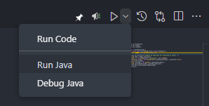

# Servidores Inversores e Cliente
<b>Thalison Botelho e Saumuel Magalhães</b>

Sistemas Concorrentes e distribuídos

# Proposta
1.Fazer um servidor(Socket TCP JAVA) que atenda aos clientes invertendo a string
recebida.

2. Modifique o arquivo do servidor da questão um para tratar as requisições dos
clientes de forma concorrente. Utilize threads.

3.Modifique o arquivo do servidor da questão 2 para garantir que apenas 8
threads sejam executadas por vez.

# Como executar o projeto
O cliente é o mesmo para todas as propostas então basta executar o mesmo usando java:

<h3>proposta 1</h3>Basta executar o arquivo <b>servidorInversor</b> usando java e logo em seguida executar o cliente e enviar um texto que o mesmo será invertido.
<h3>proposta 2</h3>Basta executar o arquivo <b>servidorInversorComThread</b> usando java e logo em seguida executar o cliente e enviar um texto que o mesmo será invertido.
<h3>proposta 3</h3>Basta executar o arquivo <b>servidorInversorOitoConexoes</b> usando java e logo em seguida executar até 8 clientes e enviar um texto que o mesmo será invertido.
